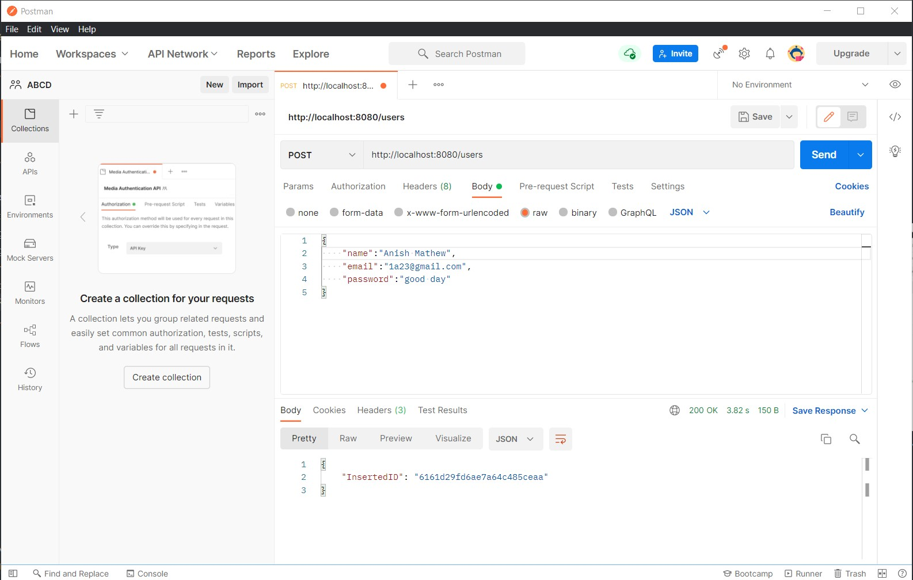
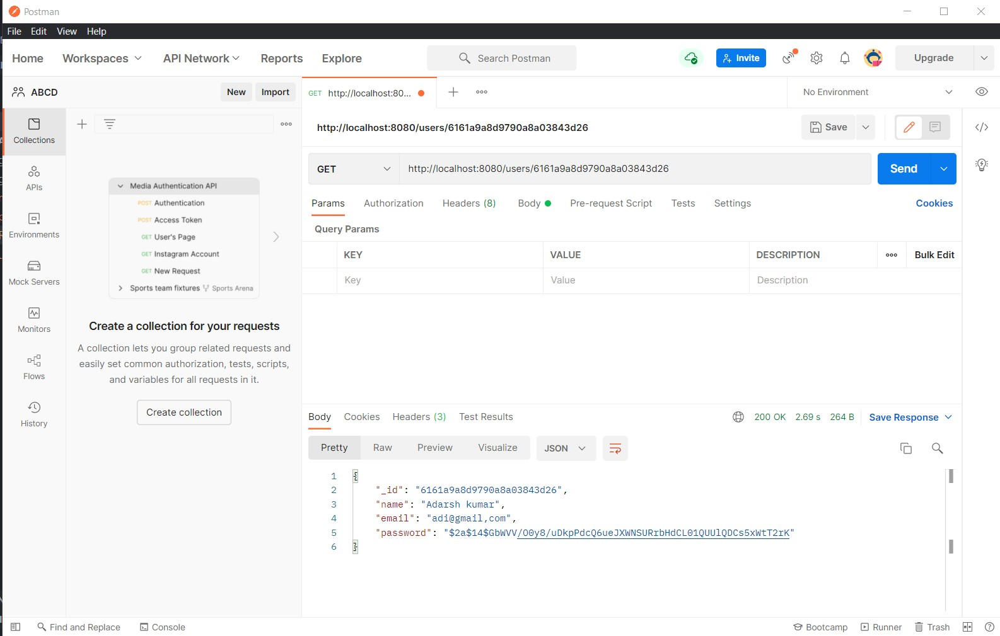
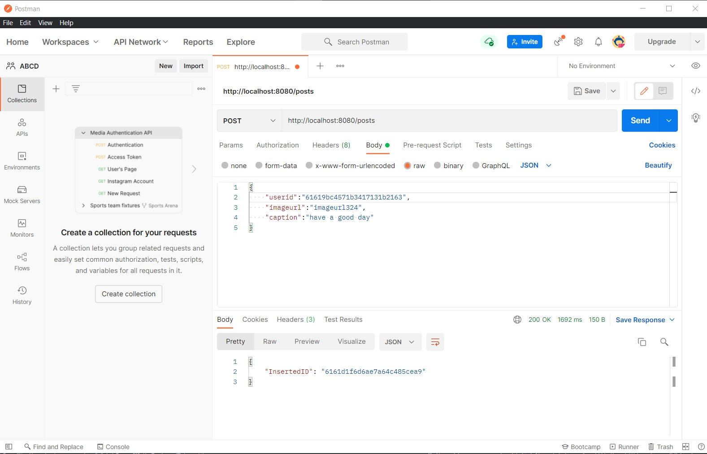
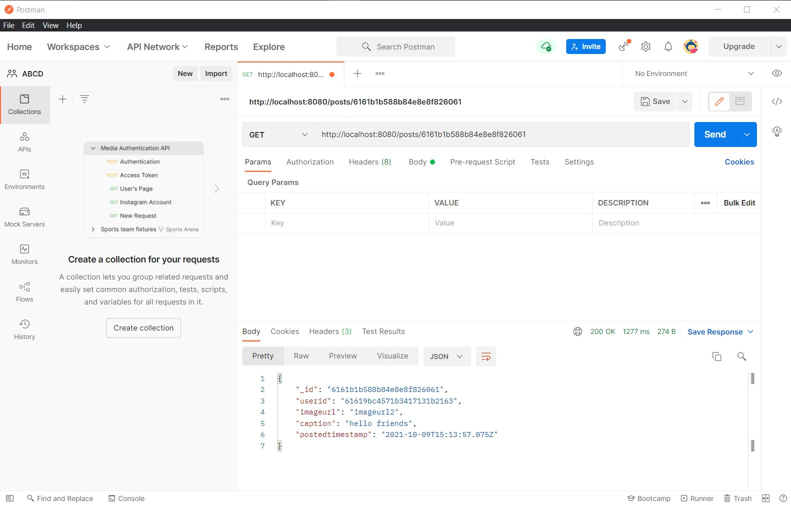
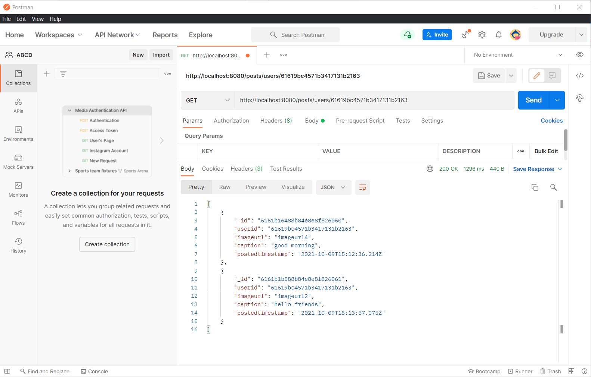

# Appointy Technical Internship task

## Create an Instagram-API using MongoDB and Golang.

### Steps to Setup this project on your local environment

First clone the Repository in you local machine using the blow command

`git clone https://github.com/Aman7445/Insta-API.git`

Go to the repository by using this command

`cd Insta-API`

Install all the dependencies and the package used in this project by using the below commands

`go install`  

To start the server run this command

`go run .`

if the terminal displays the below text it means the application is running on port 8080

`Starting the Application...`

## API's created

1)To Enter data in user collection at `http://localhost:8080/users`

2)To get user data out of user collection at `http://localhost:8080/users/{id}` replace id by the user's ID you want.

3)To Enter data in posts collection at `http://localhost:8080/posts`

4)To get post data out of posts collection at `http://localhost:8080/posts/{id}` replace id by the user's ID you want.

5)To get userspost data out of post collection at `http://localhost:8080/posts/users/{id}` replace id by the user's ID whose post you want to see.

## Screenshots

Tested the API's on the Postman tool

### Create User using GET Method

### GET User via ID using POST

### Create post using GET Method

### GET Post via ID using POST

### GET UserPost via UserID using POST

###

This repo is private right now.
